# Architecture Flow Diagram: Autonomous Campaign Generator Swarm

**Version:** 1.0.0
**Date:** 2026-02-25
**Source PRD:** campaign-generator-v3.md
**System:** claude-flow v3 hierarchical agent swarm for Topshop campaign generation

---

## Table of Contents

1. [High-Level System Architecture](#1-high-level-system-architecture)
2. [Agent Communication Topology](#2-agent-communication-topology)
3. [Phase 1: Base Image Generation Flow](#3-phase-1-base-image-generation-flow)
4. [Phase 2: Style Refinement and Scaling Flow](#4-phase-2-style-refinement-and-scaling-flow)
5. [Phase 3: Static Ad Compositing Flow](#5-phase-3-static-ad-compositing-flow)
6. [Phase 4: Animation Flow](#6-phase-4-animation-flow)
7. [QA Feedback Loop Detail](#7-qa-feedback-loop-detail)
8. [Full Pipeline Sequence Diagram](#8-full-pipeline-sequence-diagram)
9. [File System Data Flow](#9-file-system-data-flow)
10. [Error Handling and Fallback Paths](#10-error-handling-and-fallback-paths)
11. [Initialization Sequence](#11-initialization-sequence)
12. [Parallel and Sequential Dependency Map](#12-parallel-and-sequential-dependency-map)

---

## 1. High-Level System Architecture

This diagram shows the complete system boundary, all agents, external services, storage layers, and their interconnections.

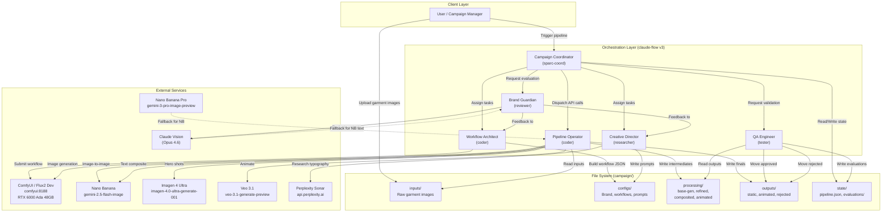

---

## 2. Agent Communication Topology

This diagram details the hierarchical agent relationships, message types, and data payloads exchanged between agents.

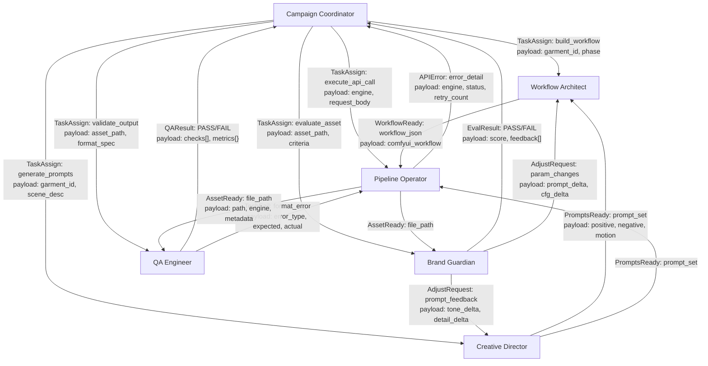

---

## 3. Phase 1: Base Image Generation Flow

Detailed flow for transforming raw garment images into base campaign shots using Flux2 Dev on the local GPU.

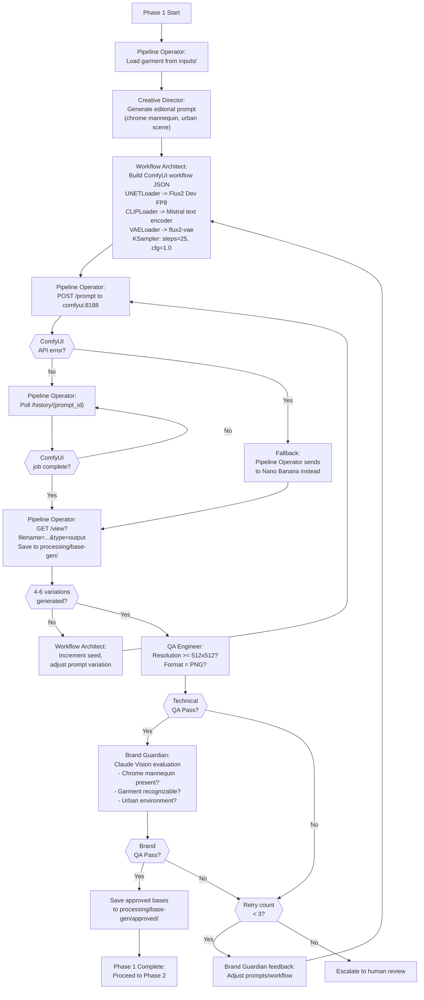

---

## 4. Phase 2: Style Refinement and Scaling Flow

Detailed flow for refining base images through Nano Banana image-to-image and generating 16-24 cohesive variations with hero shots via Imagen 4 Ultra.

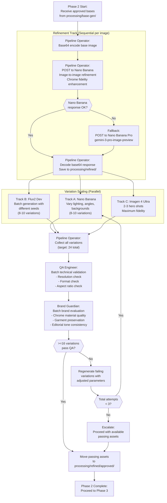

---

## 5. Phase 3: Static Ad Compositing Flow

Detailed flow for typography overlay, negative space analysis, and multi-aspect-ratio adaptation.

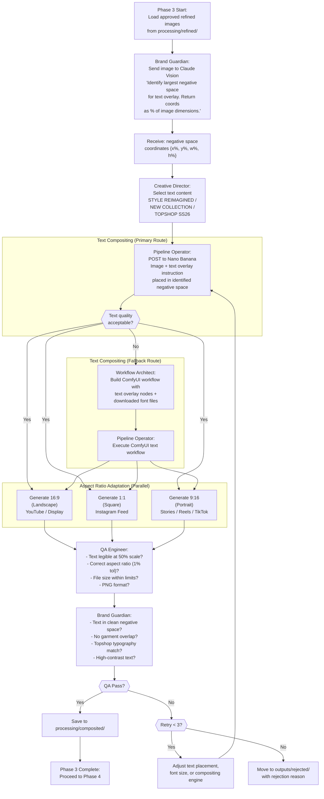

---

## 6. Phase 4: Animation Flow

Detailed flow for converting static composited ads into 8-second animated videos using Veo 3.1 with long-running operation polling.

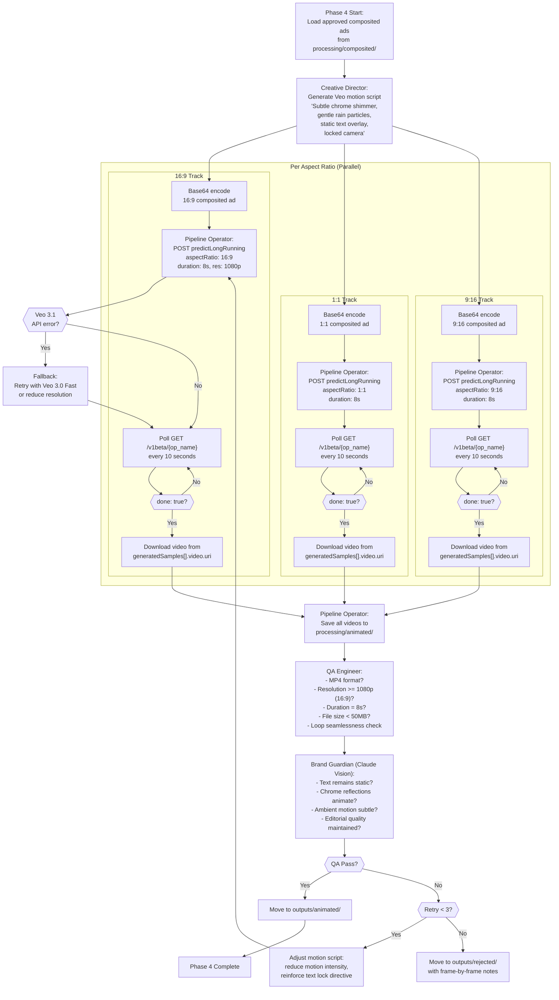

---

## 7. QA Feedback Loop Detail

This diagram isolates the QA feedback loop that applies uniformly to every asset across all four phases.

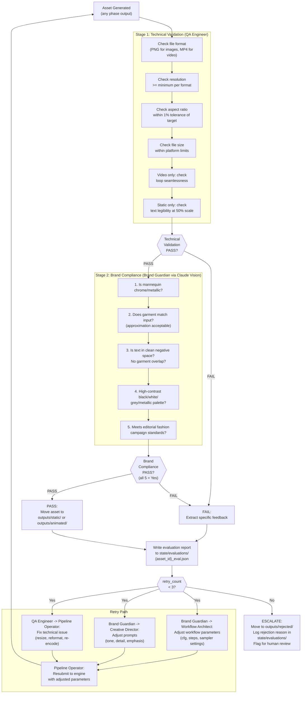

---

## 8. Full Pipeline Sequence Diagram

This sequence diagram shows the complete pipeline lifecycle from user trigger through all four phases, including agent interactions, API calls, and QA gates.

```mermaid
sequenceDiagram
    autonumber
    participant User
    participant CC as Campaign Coordinator
    participant CD as Creative Director
    participant WA as Workflow Architect
    participant PO as Pipeline Operator
    participant BG as Brand Guardian
    participant QA as QA Engineer
    participant Flux as ComfyUI/Flux2
    participant NB as Nano Banana
    participant NBP as Nano Banana Pro
    participant IMG4 as Imagen 4 Ultra
    participant Veo as Veo 3.1
    participant Perp as Perplexity
    participant CV as Claude Vision
    participant FS as File System

    rect rgb(40, 40, 60)
        Note over CC,FS: INITIALIZATION SEQUENCE
        User->>CC: Trigger pipeline (garment images in inputs/)
        CC->>PO: Validate infrastructure
        PO->>Flux: GET /system_stats
        Flux-->>PO: 200 OK (RTX 6000 Ada ready)
        PO->>NB: POST test prompt
        NB-->>PO: 200 OK
        PO->>Veo: POST test prompt
        Veo-->>PO: 200 OK (operation started)
        PO->>Perp: POST test query
        Perp-->>PO: 200 OK
        PO-->>CC: Infrastructure validated

        CC->>CD: Research typography
        CD->>Perp: POST "Topshop brand typography font family"
        Perp-->>CD: Futura/Gotham/Proxima Nova matches
        CD->>FS: Write configs/topshop.json

        CC->>WA: Build workflow templates
        WA->>FS: Write configs/workflows/*.json
        WA-->>CC: Templates ready

        CC->>CD: Generate prompt library
        CD->>FS: Write configs/prompts/*.json
        CD-->>CC: Prompts ready
    end

    rect rgb(50, 30, 30)
        Note over CC,FS: PHASE 1 - BASE IMAGE GENERATION (Flux2 Dev Local GPU)
        CC->>FS: Read inputs/ (garment images)
        CC->>CD: Generate editorial prompts for garment
        CD-->>CC: Prompt set (positive + negative)

        CC->>WA: Build Flux2 ComfyUI workflow
        WA-->>CC: Workflow JSON (UNET + CLIP + VAE + KSampler)

        loop 4-6 variations per garment
            CC->>PO: Execute generation (workflow + seed N)
            PO->>Flux: POST /prompt {workflow_json}
            Flux-->>PO: prompt_id
            loop Poll until complete
                PO->>Flux: GET /history/{prompt_id}
                Flux-->>PO: status (running/complete)
            end
            PO->>Flux: GET /view?filename=...&type=output
            Flux-->>PO: PNG image data
            PO->>FS: Save to processing/base-gen/
        end

        CC->>QA: Validate base images (batch)
        QA->>FS: Read processing/base-gen/*
        QA-->>CC: Technical QA results

        CC->>BG: Evaluate brand compliance (batch)
        BG->>CV: Analyze chrome mannequin + garment fidelity
        CV-->>BG: Evaluation scores
        BG-->>CC: PASS/FAIL per image with feedback

        alt Any FAIL and retry < 3
            CC->>WA: Adjust workflow per BG feedback
            CC->>CD: Adjust prompts per BG feedback
            Note over CC: Re-enter generation loop
        end
    end

    rect rgb(30, 50, 30)
        Note over CC,FS: PHASE 2 - STYLE REFINEMENT & SCALING (Nano Banana + Imagen 4)
        CC->>PO: Refine approved bases via Nano Banana

        loop Per approved base image
            PO->>FS: Read base image, encode base64
            PO->>NB: POST image-to-image (chrome refinement)
            alt Nano Banana error
                PO->>NBP: POST fallback to Nano Banana Pro
                NBP-->>PO: Refined image (base64)
            else Success
                NB-->>PO: Refined image (base64)
            end
            PO->>FS: Decode and save to processing/refined/
        end

        par Variation Scaling (Parallel Tracks)
            Note over PO,NB: Track A: Nano Banana variations (8-10)
            loop 8-10 Nano Banana variations
                PO->>NB: POST varied prompts (lighting/angle/bg)
                NB-->>PO: Variation image
            end
        and
            Note over PO,Flux: Track B: Flux2 batch variations (8-10)
            loop 8-10 Flux2 variations
                PO->>Flux: POST /prompt (different seeds)
                Flux-->>PO: Variation image
            end
        and
            Note over PO,IMG4: Track C: Imagen 4 hero shots (2-3)
            loop 2-3 Imagen 4 hero shots
                PO->>IMG4: POST predict (maximum fidelity)
                IMG4-->>PO: Hero image
            end
        end

        PO->>FS: Save all 24 variations to processing/refined/

        CC->>QA: Batch technical validation
        CC->>BG: Batch brand evaluation
        BG->>CV: Analyze all variations
        CV-->>BG: Per-image evaluation

        alt >= 16 pass
            BG-->>CC: Sufficient variations approved
        else < 16 pass and retry < 3
            BG-->>CC: Regenerate failing variations
            Note over CC: Re-enter scaling loop
        else < 16 pass and retry >= 3
            BG-->>CC: Proceed with available passing assets
        end
    end

    rect rgb(30, 30, 50)
        Note over CC,FS: PHASE 3 - STATIC AD COMPOSITING (Nano Banana + Claude Vision)
        loop Per approved refined image
            CC->>BG: Analyze negative space
            BG->>CV: "Identify largest negative space for text overlay"
            CV-->>BG: Coordinates {x%, y%, w%, h%}

            CC->>CD: Select typography content
            CD-->>CC: "STYLE REIMAGINED" / "NEW COLLECTION" / "TOPSHOP SS26"

            CC->>PO: Composite text via Nano Banana
            PO->>NB: POST image + text overlay instruction
            NB-->>PO: Composited image

            alt Text quality insufficient
                CC->>WA: Build ComfyUI text overlay workflow
                WA-->>PO: Text workflow JSON
                PO->>Flux: POST /prompt (text overlay nodes)
                Flux-->>PO: Composited image
            end

            par Aspect Ratio Adaptation (Parallel)
                PO->>NB: Generate 16:9 version
                NB-->>PO: 16:9 ad
            and
                PO->>NB: Generate 1:1 version
                NB-->>PO: 1:1 ad
            and
                PO->>NB: Generate 9:16 version
                NB-->>PO: 9:16 ad
            end

            PO->>FS: Save all formats to processing/composited/
        end

        CC->>QA: Validate text legibility + aspect ratios
        CC->>BG: Validate text placement + brand compliance
        BG->>CV: Analyze text overlay quality
        CV-->>BG: Evaluation results
        BG-->>CC: PASS/FAIL per asset
    end

    rect rgb(50, 40, 30)
        Note over CC,FS: PHASE 4 - ANIMATION (Veo 3.1)
        CC->>CD: Generate Veo motion scripts
        CD-->>CC: Motion scripts (shimmer, rain, locked camera)

        par Animate All Aspect Ratios (Parallel)
            PO->>FS: Encode 16:9 composited ad (base64)
            PO->>Veo: POST predictLongRunning (16:9, 8s, 1080p)
            Veo-->>PO: operation_name
            loop Poll every 10s
                PO->>Veo: GET /v1beta/{operation_name}
                Veo-->>PO: {done: false} / {done: true, video_uri}
            end
            PO->>Veo: Download video from URI
            Veo-->>PO: MP4 video data
        and
            PO->>Veo: POST predictLongRunning (1:1, 8s)
            Note over PO,Veo: Same poll/download cycle
        and
            PO->>Veo: POST predictLongRunning (9:16, 8s)
            Note over PO,Veo: Same poll/download cycle
        end

        PO->>FS: Save all videos to processing/animated/

        CC->>QA: Validate video specs (format, duration, size)
        QA-->>CC: Technical results

        CC->>BG: Evaluate video brand compliance
        BG->>CV: Analyze video frames (text static? chrome animates?)
        CV-->>BG: Video evaluation
        BG-->>CC: PASS/FAIL per video

        alt PASS
            PO->>FS: Move to outputs/animated/
        else FAIL and retry < 3
            CC->>CD: Adjust motion script
            Note over CC: Re-enter animation loop
        else FAIL and retry >= 3
            PO->>FS: Move to outputs/rejected/
        end
    end

    rect rgb(40, 50, 40)
        Note over CC,FS: PIPELINE COMPLETE
        CC->>FS: Update state/pipeline.json (status: complete)
        CC->>FS: Write final evaluation summary to state/evaluations/
        CC-->>User: Pipeline complete. Assets in outputs/
    end
```

---

## 9. File System Data Flow

This diagram traces the complete lifecycle of data through the file system, from raw inputs to final approved outputs.

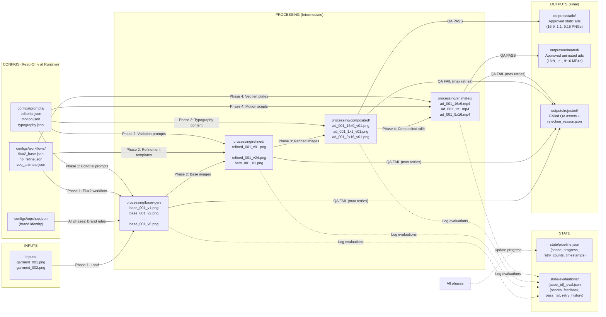

---

## 10. Error Handling and Fallback Paths

This diagram documents every error condition, its fallback path, and the escalation chain.

```mermaid
flowchart TD
    subgraph "ComfyUI / Flux2 Errors"
        COMFY_ERR["ComfyUI API unreachable<br/>or workflow execution error"]
        COMFY_F1["Fallback 1: Retry with<br/>exponential backoff (3 attempts)"]
        COMFY_F2["Fallback 2: Route to<br/>Nano Banana for base gen"]
        COMFY_F3["Fallback 3: Route to<br/>Imagen 4 Fast for batch gen"]
        COMFY_ESC["Escalate: Log error,<br/>mark garment as blocked,<br/>continue with other garments"]

        COMFY_ERR --> COMFY_F1
        COMFY_F1 -->|"Still failing"| COMFY_F2
        COMFY_F2 -->|"Still failing"| COMFY_F3
        COMFY_F3 -->|"Still failing"| COMFY_ESC
    end

    subgraph "Nano Banana Errors"
        NB_ERR["Nano Banana API error<br/>(rate limit, 500, timeout)"]
        NB_F1["Fallback 1: Retry with<br/>exponential backoff (3 attempts)"]
        NB_F2["Fallback 2: Route to<br/>Nano Banana Pro<br/>(gemini-3-pro-image-preview)"]
        NB_F3["Fallback 3: Route to<br/>Flux2 Dev local for gen,<br/>Claude Vision for eval"]
        NB_ESC["Escalate: Log error,<br/>proceed with available assets"]

        NB_ERR --> NB_F1
        NB_F1 -->|"Still failing"| NB_F2
        NB_F2 -->|"Still failing"| NB_F3
        NB_F3 -->|"Still failing"| NB_ESC
    end

    subgraph "Imagen 4 Ultra Errors"
        IMG_ERR["Imagen 4 API error<br/>(quota, auth, timeout)"]
        IMG_F1["Fallback 1: Retry with<br/>exponential backoff (3 attempts)"]
        IMG_F2["Fallback 2: Route to<br/>Nano Banana Pro for hero shots"]
        IMG_F3["Fallback 3: Use best<br/>Flux2 Dev output as hero"]
        IMG_ESC["Escalate: Skip hero shots,<br/>proceed with standard assets"]

        IMG_ERR --> IMG_F1
        IMG_F1 -->|"Still failing"| IMG_F2
        IMG_F2 -->|"Still failing"| IMG_F3
        IMG_F3 -->|"Still failing"| IMG_ESC
    end

    subgraph "Veo 3.1 Errors"
        VEO_ERR["Veo 3.1 API error<br/>(timeout, generation fail,<br/>content filter)"]
        VEO_F1["Fallback 1: Retry with<br/>adjusted prompt (remove<br/>flagged terms)"]
        VEO_F2["Fallback 2: Route to<br/>Veo 3.0 Fast<br/>(lower quality, faster)"]
        VEO_F3["Fallback 3: Reduce resolution<br/>or duration (4s instead of 8s)"]
        VEO_ESC["Escalate: Skip animation<br/>for this asset, deliver<br/>static-only version"]

        VEO_ERR --> VEO_F1
        VEO_F1 -->|"Still failing"| VEO_F2
        VEO_F2 -->|"Still failing"| VEO_F3
        VEO_F3 -->|"Still failing"| VEO_ESC
    end

    subgraph "Perplexity Errors"
        PERP_ERR["Perplexity API error"]
        PERP_F1["Fallback: Use hardcoded<br/>typography defaults<br/>(Futura/Gotham)"]

        PERP_ERR --> PERP_F1
    end

    subgraph "QA Loop Exhaustion"
        QA_EXHAUST["Asset fails QA<br/>3 times consecutively"]
        QA_F1["Move to outputs/rejected/<br/>with detailed rejection log"]
        QA_F2["Write evaluation to<br/>state/evaluations/"]
        QA_F3["Campaign Coordinator:<br/>Flag for human review<br/>in pipeline.json"]

        QA_EXHAUST --> QA_F1
        QA_F1 --> QA_F2
        QA_F2 --> QA_F3
    end

    subgraph "Pipeline State Recovery"
        STATE_ERR["Container restart or<br/>unexpected termination"]
        STATE_F1["Read state/pipeline.json<br/>to determine last<br/>completed phase"]
        STATE_F2["Resume from last<br/>checkpoint, skip<br/>completed assets"]
        STATE_F3["Re-validate all<br/>processing/ intermediates<br/>before continuing"]

        STATE_ERR --> STATE_F1
        STATE_F1 --> STATE_F2
        STATE_F2 --> STATE_F3
    end
```

---

## 11. Initialization Sequence

This diagram shows the detailed startup sequence including infrastructure validation, configuration loading, and the transition to the main pipeline.

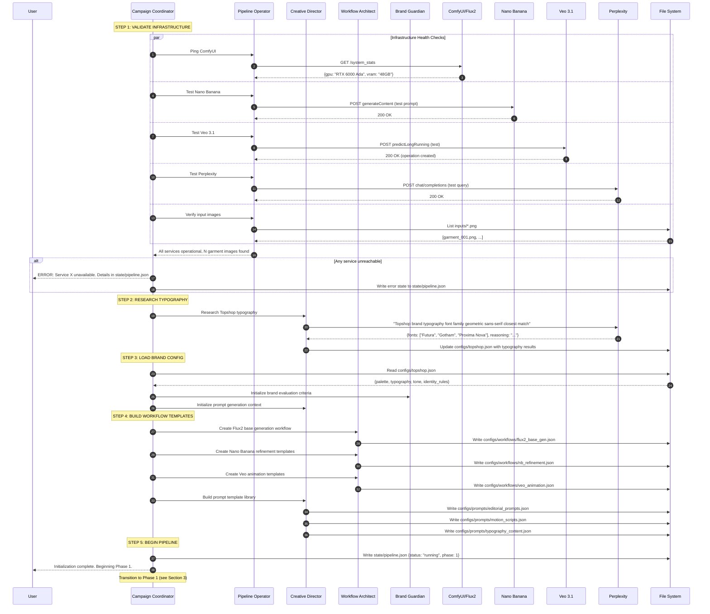

---

## 12. Parallel and Sequential Dependency Map

This diagram maps all operations in the pipeline, identifying which can run in parallel and which have hard sequential dependencies.

```mermaid
graph LR
    subgraph "INIT (Sequential)"
        I1["Validate<br/>Infrastructure"]
        I2["Research<br/>Typography"]
        I3["Load Brand<br/>Config"]
        I4["Build Workflow<br/>Templates"]
        I5["Build Prompt<br/>Library"]

        I1 --> I2
        I2 --> I3
        I3 --> I4
        I3 --> I5
    end

    subgraph "PHASE 1 (Per Garment: Parallel Across Garments)"
        P1A["Generate<br/>Prompts"]
        P1B["Build ComfyUI<br/>Workflow"]
        P1C["Submit to<br/>Flux2 Dev"]
        P1D["Variation Loop<br/>(4-6 seeds)"]
        P1E["Technical QA"]
        P1F["Brand QA"]

        P1A --> P1B
        P1B --> P1C
        P1C --> P1D
        P1D --> P1E
        P1E --> P1F
    end

    subgraph "PHASE 2 (Mixed Parallel/Sequential)"
        P2A["Base64 Encode<br/>Approved Bases"]
        P2B["NB Image-to-Image<br/>Refinement<br/>(Sequential per image)"]

        P2C["Track A: NB<br/>Variations (8-10)"]
        P2D["Track B: Flux2<br/>Batch (8-10)"]
        P2E["Track C: Imagen 4<br/>Heroes (2-3)"]

        P2F["Collect All<br/>Variations"]
        P2G["Batch QA +<br/>Brand Eval"]

        P2A --> P2B
        P2B --> P2C
        P2B --> P2D
        P2B --> P2E
        P2C --> P2F
        P2D --> P2F
        P2E --> P2F
        P2F --> P2G
    end

    subgraph "PHASE 3 (Per Image: Sequential; Aspect Ratios: Parallel)"
        P3A["Negative Space<br/>Analysis<br/>(Claude Vision)"]
        P3B["Select<br/>Typography"]
        P3C["Text Composite<br/>(NB or ComfyUI)"]

        P3D["Adapt 16:9"]
        P3E["Adapt 1:1"]
        P3F["Adapt 9:16"]

        P3G["QA + Brand<br/>Validation"]

        P3A --> P3B
        P3B --> P3C
        P3C --> P3D
        P3C --> P3E
        P3C --> P3F
        P3D --> P3G
        P3E --> P3G
        P3F --> P3G
    end

    subgraph "PHASE 4 (Aspect Ratios: Parallel)"
        P4A["Generate Motion<br/>Scripts"]

        P4B["Veo 3.1<br/>16:9 (poll)"]
        P4C["Veo 3.1<br/>1:1 (poll)"]
        P4D["Veo 3.1<br/>9:16 (poll)"]

        P4E["Video QA +<br/>Brand Eval"]

        P4A --> P4B
        P4A --> P4C
        P4A --> P4D
        P4B --> P4E
        P4C --> P4E
        P4D --> P4E
    end

    I4 --> P1A
    I5 --> P1A
    P1F -->|"Hard dependency:<br/>Phase 1 must complete"| P2A
    P2G -->|"Hard dependency:<br/>Phase 2 must complete"| P3A
    P3G -->|"Hard dependency:<br/>Phase 3 must complete"| P4A
```

### Dependency Summary Table

| Operation | Type | Depends On | Can Parallel With |
|-----------|------|------------|-------------------|
| Infrastructure validation | Sequential | Nothing | Nothing (must be first) |
| Typography research | Sequential | Infra validation | Nothing |
| Brand config load | Sequential | Typography research | Nothing |
| Workflow template build | Sequential | Brand config | Prompt library build |
| Prompt library build | Sequential | Brand config | Workflow template build |
| Phase 1: Per-garment generation | Parallel per garment | Init complete | Other garment P1 pipelines |
| Phase 1: Variation loop (per garment) | Sequential | Prior variation | Nothing |
| Phase 1: QA gate | Sequential | All variations generated | Nothing |
| Phase 2: NB refinement | Sequential per image | Phase 1 QA pass | Nothing |
| Phase 2: Variation scaling | Parallel (3 tracks) | Refinement complete | All 3 tracks run simultaneously |
| Phase 2: QA gate | Sequential | All variations collected | Nothing |
| Phase 3: Negative space analysis | Sequential per image | Phase 2 QA pass | Nothing |
| Phase 3: Aspect ratio adaptation | Parallel (3 formats) | Text composite done | All 3 ratios run simultaneously |
| Phase 3: QA gate | Sequential | All formats generated | Nothing |
| Phase 4: Motion script gen | Sequential | Phase 3 QA pass | Nothing |
| Phase 4: Veo animation | Parallel (3 formats) | Motion script ready | All 3 ratios run simultaneously |
| Phase 4: QA gate | Sequential | All videos downloaded | Nothing |

### Critical Path

The longest sequential chain that determines minimum pipeline duration:

```
Infra Validation -> Typography Research -> Brand Config -> Templates/Prompts
-> Phase 1 Generation (4-6 variations, sequential per seed)
-> Phase 1 QA
-> Phase 2 Refinement (sequential per image)
-> Phase 2 Scaling (parallel, bounded by slowest track)
-> Phase 2 QA
-> Phase 3 Negative Space Analysis
-> Phase 3 Text Composite
-> Phase 3 Aspect Ratio Adaptation (parallel)
-> Phase 3 QA
-> Phase 4 Motion Script
-> Phase 4 Veo Animation (parallel, bounded by longest poll)
-> Phase 4 QA
-> Pipeline Complete
```

Estimated critical path time: 20-30 minutes per garment (dominated by Veo 3.1 polling latency and QA retry loops).

---

## Appendix A: Engine Routing Decision Matrix

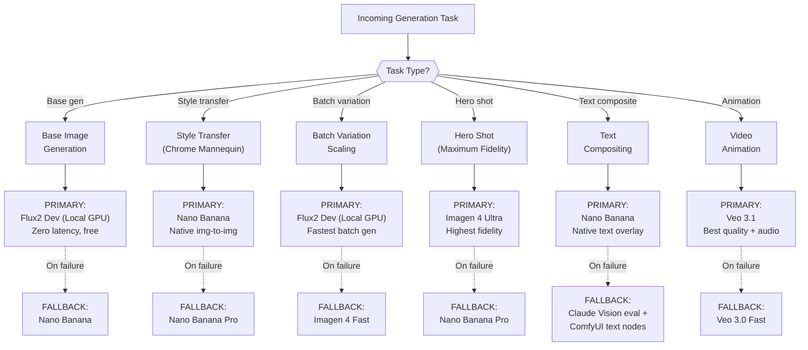

---

## Appendix B: State Machine for Pipeline Lifecycle

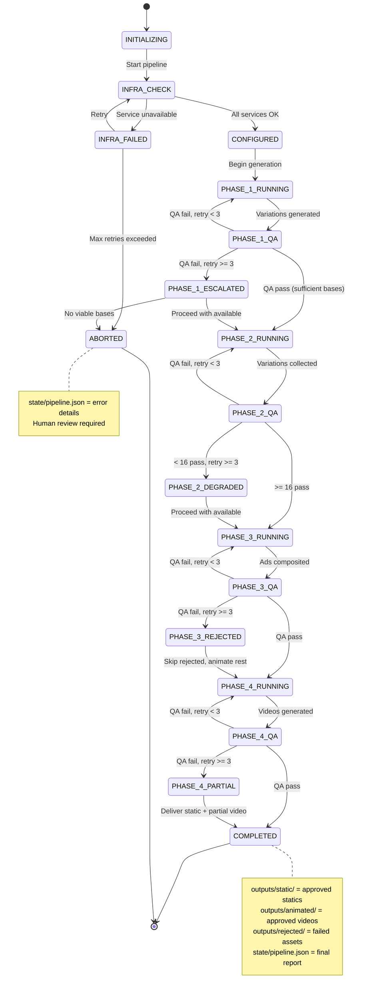

---

## Appendix C: API Call Flow Summary

| Agent | Service | Endpoint | Method | Payload Direction | Response |
|-------|---------|----------|--------|-------------------|----------|
| Pipeline Operator | ComfyUI | `comfyui:8188/prompt` | POST | Workflow JSON -> ComfyUI | prompt_id |
| Pipeline Operator | ComfyUI | `comfyui:8188/history/{id}` | GET | -- | Job status |
| Pipeline Operator | ComfyUI | `comfyui:8188/view` | GET | Query params -> ComfyUI | PNG image bytes |
| Pipeline Operator | Nano Banana | `googleapis.com/.../generateContent` | POST | Base64 image + prompt -> Google | Base64 PNG in JSON |
| Pipeline Operator | Nano Banana Pro | `googleapis.com/.../generateContent` | POST | Base64 image + prompt -> Google | Base64 PNG in JSON |
| Pipeline Operator | Imagen 4 Ultra | `googleapis.com/.../predict` | POST | Prompt + params -> Google | Base64 image in JSON |
| Pipeline Operator | Veo 3.1 | `googleapis.com/.../predictLongRunning` | POST | Base64 image + prompt -> Google | operation_name |
| Pipeline Operator | Veo 3.1 | `googleapis.com/v1beta/{op}` | GET | -- | Status + video URI |
| Creative Director | Perplexity | `api.perplexity.ai/chat/completions` | POST | Research query -> Perplexity | JSON response |
| Brand Guardian | Claude Vision | (Internal Anthropic API) | POST | Image + eval prompt -> Claude | Structured evaluation |

---

## Appendix D: Retry and Backoff Strategy

All API calls follow exponential backoff with jitter:

```
Attempt 1: immediate
Attempt 2: 2s + random(0-1s)
Attempt 3: 4s + random(0-2s)
```

QA retry loops follow a different cadence:

```
QA Retry 1: Adjust parameters (prompt weight, cfg, seed) -> regenerate
QA Retry 2: Adjust parameters more aggressively + try alternate engine -> regenerate
QA Retry 3: (final) Use most permissive parameters -> regenerate
After Retry 3: Move to outputs/rejected/, flag for human review
```

Maximum total retries per asset across all failure types: **3 per QA gate, 3 per API call** (9 total attempts worst case per asset per phase).
