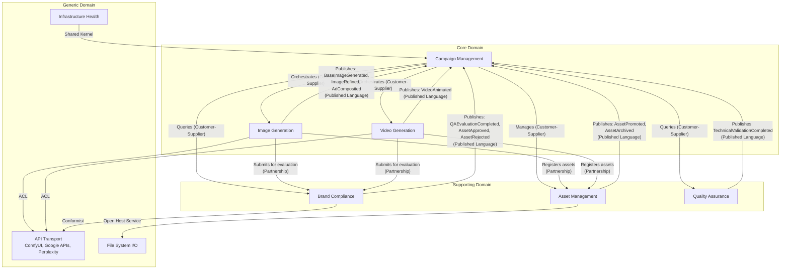
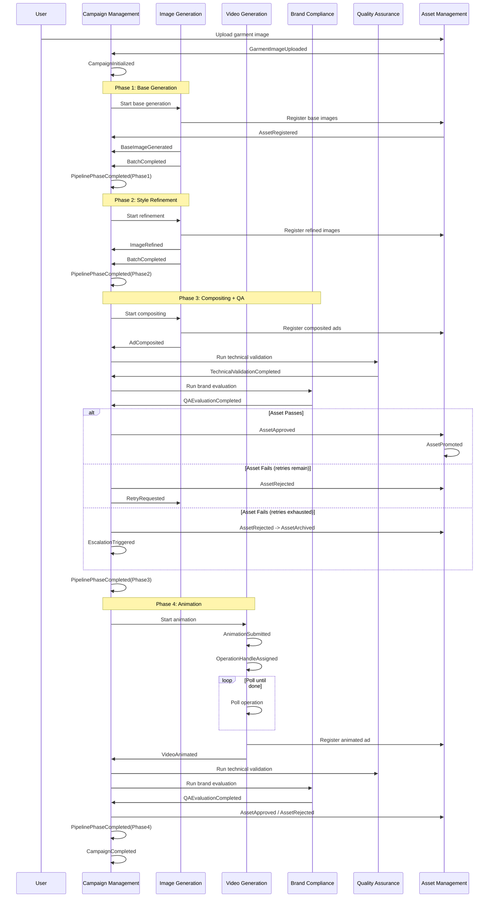

# Domain-Driven Design Analysis: Autonomous Campaign Generator Swarm

## 1. Domain Overview

The Campaign Generator is an autonomous creative pipeline that transforms raw garment imagery into multi-format, animated ad campaigns for the Topshop brand. The domain sits at the intersection of creative production, brand management, and distributed system orchestration. It coordinates multiple AI generation backends (Flux2, Nano Banana, Imagen 4, Veo 3.1) through a hierarchical agent swarm to produce static and animated advertisements that conform to Topshop brand identity.

The **core domain** is the campaign production pipeline itself: the sequenced transformation of a garment photograph through base generation, style refinement, text compositing, and animation, governed by brand compliance rules and quality gates. The **supporting domains** include brand compliance evaluation, asset management, and quality assurance. The **generic domains** cover API transport, file I/O, and infrastructure health checks.

---

## 2. Bounded Contexts

### 2.1 Campaign Management (Core Domain)

**Responsibility:** Owns the campaign lifecycle from initialization through completion. Manages pipeline phases, coordinates agent work assignments, tracks overall progress, handles error escalation, and enforces the sequencing invariant that phases must complete in order.

**Key Concepts:**
- Campaign as the top-level aggregate with a defined lifecycle (Initializing, Running, Paused, Completed, Failed)
- Pipeline phases as ordered stages with entry/exit criteria
- Agent task assignments tracked against phases
- Retry budgets and escalation thresholds

**Owned Data:**
- `state/pipeline.json` -- authoritative pipeline state
- Campaign configuration derived from brand config

### 2.2 Image Generation (Core Domain)

**Responsibility:** Produces all static imagery across the pipeline. Encapsulates the routing logic that selects the optimal engine (Flux2 Dev, Nano Banana, Nano Banana Pro, Imagen 4 Ultra) for each generation task. Manages prompt construction, API payload assembly, submission, polling, and response decoding.

**Key Concepts:**
- Generation Request as a unit of work with engine, prompt, parameters, and source image
- Engine Routing as a policy that maps task type to optimal backend
- Generation Result carrying the produced image with metadata
- Fallback chains when primary engines fail

**Owned Data:**
- `processing/base-gen/` -- Phase 1 outputs
- `processing/refined/` -- Phase 2 outputs
- `processing/composited/` -- Phase 3 outputs
- `configs/workflows/` -- ComfyUI workflow templates
- `configs/prompts/` -- prompt template library

### 2.3 Video Generation (Core Domain)

**Responsibility:** Produces animated ad videos from static composited images. Encapsulates the Veo 3.1 long-running operation lifecycle: submission, polling, retrieval, and format handling. Manages motion script generation and video-specific parameters (duration, resolution, aspect ratio).

**Key Concepts:**
- Animation Job as an asynchronous unit of work with a long-running operation handle
- Motion Script as a domain-specific prompt optimized for subtle ambient motion
- Operation Polling with configurable intervals
- Video Retrieval from URI-based responses

**Owned Data:**
- `processing/animated/` -- Phase 4 outputs
- Veo operation handles and polling state

### 2.4 Brand Compliance (Supporting Domain)

**Responsibility:** Enforces Topshop visual identity rules across all generated assets. Evaluates images and videos against a codified brand standard using Claude Vision. Produces pass/fail verdicts with actionable feedback that drives iteration loops.

**Key Concepts:**
- Brand Identity as a configuration-driven ruleset (palette, typography, tone, material requirements)
- Evaluation Criteria as discrete checkpoints (chrome material, garment fidelity, text placement, palette conformance, editorial quality)
- Compliance Verdict as a scored pass/fail result with per-criterion feedback
- Negative Space Analysis for typography placement guidance

**Owned Data:**
- `configs/topshop.json` -- brand identity configuration
- Evaluation criteria definitions
- Typography research results

### 2.5 Asset Management (Supporting Domain)

**Responsibility:** Manages the lifecycle of all generated files. Handles directory organization, format conversion, file naming conventions, storage, and the promotion of assets from processing directories to final output directories. Tracks asset lineage (which input produced which outputs through which phases).

**Key Concepts:**
- Asset as a tracked file with metadata (format, resolution, aspect ratio, file size, lineage)
- Asset Lineage tracing the chain from input garment to final output
- Directory Structure as an enforced organizational policy
- Format Conversion between image and video formats
- Asset Promotion from processing to outputs

**Owned Data:**
- `inputs/` -- source garment images
- `outputs/static/` -- approved static ads
- `outputs/animated/` -- approved animated ads
- `outputs/rejected/` -- failed assets with rejection metadata

### 2.6 Quality Assurance (Supporting Domain)

**Responsibility:** Performs automated technical validation on all generated assets. Distinct from Brand Compliance in that it checks measurable technical properties (resolution, format, file size, aspect ratio tolerance) rather than subjective brand alignment. Aggregates metrics across pipeline runs.

**Key Concepts:**
- Technical Validation as a suite of automated checks
- Quality Gate as a mandatory checkpoint before asset promotion
- Evaluation Report as a structured record of all checks performed
- Pipeline Metrics aggregated across assets and runs

**Owned Data:**
- `state/evaluations/` -- per-asset evaluation reports
- Quality threshold configurations
- Aggregate pipeline metrics

---

## 3. Context Map



### Context Map Relationships

| Upstream | Downstream | Pattern | Description |
|----------|-----------|---------|-------------|
| **Campaign Management** | Image Generation | Customer-Supplier | Campaign Management defines what images are needed; Image Generation fulfills requests |
| **Campaign Management** | Video Generation | Customer-Supplier | Campaign Management defines what videos are needed; Video Generation fulfills requests |
| **Campaign Management** | Quality Assurance | Customer-Supplier | Campaign Management requests quality reports; QA delivers them |
| **Campaign Management** | Brand Compliance | Customer-Supplier | Campaign Management submits assets for brand review; Brand Compliance returns verdicts |
| **Campaign Management** | Asset Management | Customer-Supplier | Campaign Management directs asset lifecycle transitions |
| **Image Generation** | API Transport | Anti-Corruption Layer | Image Generation shields domain model from raw API specifics (ComfyUI workflow JSON, Nano Banana payload format, Imagen 4 predict format) |
| **Video Generation** | API Transport | Anti-Corruption Layer | Video Generation shields domain model from Veo 3.1 long-running operation protocol details |
| **Brand Compliance** | API Transport | Conformist | Brand Compliance conforms to Claude Vision API response structure for evaluations |
| **Image Generation** | Brand Compliance | Partnership | Tight bidirectional collaboration: Image Generation submits assets, Brand Compliance returns feedback that drives re-generation |
| **Video Generation** | Brand Compliance | Partnership | Same bidirectional collaboration for video assets |
| **Image Generation** | Asset Management | Partnership | Image Generation produces files, Asset Management tracks and organizes them |
| **Video Generation** | Asset Management | Partnership | Video Generation produces files, Asset Management tracks and organizes them |
| **Asset Management** | File System I/O | Open Host Service | Asset Management exposes a clean domain interface over raw file system operations |
| **Infrastructure Health** | Campaign Management | Shared Kernel | Both contexts share infrastructure status concepts (service availability, health checks) |

---

## 4. Aggregates, Entities, and Value Objects

### 4.1 Campaign Management Context

#### Aggregate Root: Campaign

```typescript
// ============================================================
// AGGREGATE ROOT: Campaign
// Consistency boundary for the entire campaign lifecycle.
// All phase transitions and state mutations go through this root.
// ============================================================

class Campaign {
  private readonly id: CampaignId;
  private status: CampaignStatus;
  private readonly garments: GarmentInput[];
  private readonly phases: PipelinePhase[];
  private readonly brandConfigRef: BrandConfigReference;
  private currentPhaseIndex: number;
  private readonly retryBudget: RetryBudget;
  private readonly createdAt: Timestamp;
  private updatedAt: Timestamp;
  private readonly domainEvents: DomainEvent[] = [];

  // -- Commands --

  initialize(infrastructure: InfrastructureStatus): void {
    // INVARIANT: All required services must be healthy before initialization
    // INVARIANT: At least one garment input must exist
    this.raise(new CampaignInitialized(this.id, this.garments, infrastructure));
  }

  advancePhase(): void {
    // INVARIANT: Current phase must be Completed before advancing
    // INVARIANT: Cannot advance beyond final phase
    this.raise(new PipelinePhaseCompleted(this.id, this.currentPhase()));
  }

  recordAssetResult(assetId: AssetId, verdict: ComplianceVerdict): void {
    // INVARIANT: Asset must belong to current phase
    // INVARIANT: Retry budget must not be exhausted for failures
    if (verdict.passed) {
      this.raise(new AssetApproved(this.id, assetId, verdict));
    } else {
      this.raise(new AssetRejected(this.id, assetId, verdict));
    }
  }

  escalate(reason: EscalationReason): void {
    // INVARIANT: Only triggered after retry budget exhausted
    this.raise(new EscalationTriggered(this.id, reason));
  }

  complete(): void {
    // INVARIANT: All phases must be completed
    // INVARIANT: Minimum asset thresholds met (16 static, 4 animated)
    this.raise(new CampaignCompleted(this.id));
  }

  fail(reason: FailureReason): void {
    this.raise(new CampaignFailed(this.id, reason));
  }

  // -- Queries --

  currentPhase(): PipelinePhase { /* ... */ }
  progress(): CampaignProgress { /* ... */ }
  canAdvance(): boolean { /* ... */ }
  isRetryBudgetExhausted(assetId: AssetId): boolean { /* ... */ }
}
```

**Entities:**

```typescript
// Entity: PipelinePhase
// Has identity within the campaign (phase number/name).
// Tracks its own completion state.
class PipelinePhase {
  readonly phaseNumber: PhaseNumber;
  readonly phaseType: PhaseType; // BaseGeneration, StyleRefinement, Compositing, Animation
  status: PhaseStatus; // Pending, InProgress, Completed, Failed
  readonly entryCriteria: EntryCriteria;
  readonly exitCriteria: ExitCriteria;
  readonly assignedTasks: TaskAssignment[];
  startedAt: Timestamp | null;
  completedAt: Timestamp | null;
}

// Entity: TaskAssignment
// Tracks a unit of work assigned to an agent within a phase.
class TaskAssignment {
  readonly taskId: TaskId;
  readonly agentRole: AgentRole;
  status: TaskStatus; // Assigned, InProgress, Completed, Failed
  retryCount: number;
  result: TaskResult | null;
}
```

**Value Objects:**

```typescript
class CampaignId { constructor(readonly value: string) {} }
class TaskId { constructor(readonly value: string) {} }
class AssetId { constructor(readonly value: string) {} }

enum CampaignStatus { Initializing, Running, Paused, Completed, Failed }
enum PhaseType { BaseGeneration, StyleRefinement, Compositing, Animation }
enum PhaseStatus { Pending, InProgress, Completed, Failed }
enum AgentRole { Coordinator, WorkflowArchitect, CreativeDirector, BrandGuardian, PipelineOperator, QAEngineer }

class RetryBudget {
  constructor(
    readonly maxRetriesPerAsset: number, // default: 3
    readonly maxRetriesPerPhase: number,
    private readonly usedRetries: Map<string, number>
  ) {}
  isExhausted(assetId: AssetId): boolean { /* ... */ }
  consume(assetId: AssetId): void { /* ... */ }
}

class EntryCriteria {
  constructor(readonly requiredPhaseCompleted: PhaseType | null) {}
}

class ExitCriteria {
  constructor(
    readonly minimumPassedAssets: number,
    readonly minimumPassRate: number // 0.0 - 1.0
  ) {}
}

class CampaignProgress {
  constructor(
    readonly totalPhases: number,
    readonly completedPhases: number,
    readonly currentPhaseProgress: PhaseProgress,
    readonly totalAssetsGenerated: number,
    readonly totalAssetsPassed: number,
    readonly totalAssetsFailed: number
  ) {}
}

class BrandConfigReference {
  constructor(readonly configPath: FilePath) {}
}

class Timestamp {
  constructor(readonly value: Date) {}
}
```

---

### 4.2 Image Generation Context

#### Aggregate Root: GenerationBatch

```typescript
// ============================================================
// AGGREGATE ROOT: GenerationBatch
// Consistency boundary for a set of related image generation
// requests within a single pipeline phase.
// ============================================================

class GenerationBatch {
  private readonly id: BatchId;
  private readonly campaignId: CampaignId;
  private readonly phase: GenerationPhase;
  private readonly requests: GenerationRequest[];
  private readonly engineRouting: EngineRoutingPolicy;
  private status: BatchStatus;
  private readonly domainEvents: DomainEvent[] = [];

  // -- Commands --

  submitRequest(request: GenerationRequest): void {
    // INVARIANT: Request engine must match phase routing policy
    // INVARIANT: Batch must be in Pending or InProgress status
    this.raise(new GenerationRequestSubmitted(this.id, request));
  }

  recordResult(requestId: RequestId, result: GenerationResult): void {
    // INVARIANT: Request must exist in this batch
    if (result.succeeded) {
      this.raise(new ImageGenerated(this.id, requestId, result));
    } else {
      this.raise(new GenerationFailed(this.id, requestId, result.error));
    }
  }

  fallbackEngine(requestId: RequestId): EngineType {
    // INVARIANT: Fallback must exist for the current engine
    return this.engineRouting.fallbackFor(
      this.findRequest(requestId).engine
    );
  }

  complete(): void {
    // INVARIANT: All requests must be resolved (succeeded or exhausted retries)
    this.raise(new BatchCompleted(this.id, this.phase, this.results()));
  }
}
```

**Entities:**

```typescript
// Entity: GenerationRequest
// Represents a single image generation job sent to an engine.
class GenerationRequest {
  readonly requestId: RequestId;
  readonly engine: EngineType;
  readonly prompt: GenerationPrompt;
  readonly sourceImage: SourceImage | null; // null for text-to-image
  readonly parameters: GenerationParameters;
  status: RequestStatus;
  result: GenerationResult | null;
  retryCount: number;
}
```

**Value Objects:**

```typescript
class BatchId { constructor(readonly value: string) {} }
class RequestId { constructor(readonly value: string) {} }

enum GenerationPhase { BaseGeneration, StyleRefinement, TextCompositing }
enum EngineType { Flux2Dev, NanoBanana, NanoBananaPro, Imagen4Ultra }
enum BatchStatus { Pending, InProgress, Completed, Failed }
enum RequestStatus { Pending, Submitted, Completed, Failed }

class GenerationPrompt {
  constructor(
    readonly positive: string,
    readonly negative: string | null,
    readonly templateId: PromptTemplateId | null
  ) {}
}

class SourceImage {
  constructor(
    readonly filePath: FilePath,
    readonly mimeType: MimeType,
    readonly base64Data: string | null // lazy-loaded
  ) {}
}

class GenerationParameters {
  constructor(
    readonly aspectRatio: AspectRatio,
    readonly resolution: Resolution,
    readonly samplerConfig: SamplerConfig | null, // Flux2-specific
    readonly imageSize: string | null,            // Nano Banana-specific
    readonly sampleCount: number                  // How many variations
  ) {}
}

class AspectRatio {
  constructor(readonly width: number, readonly height: number) {
    // INVARIANT: Must be one of 16:9, 1:1, 9:16, 3:4
  }
  toString(): string { return `${this.width}:${this.height}`; }
}

class Resolution {
  constructor(readonly width: number, readonly height: number) {
    // INVARIANT: width >= 512 && height >= 512
  }
}

class SamplerConfig {
  constructor(
    readonly steps: number,      // default: 25
    readonly cfg: number,        // default: 1.0
    readonly sampler: string,    // default: "euler"
    readonly scheduler: string   // default: "simple"
  ) {}
}

class GenerationResult {
  constructor(
    readonly succeeded: boolean,
    readonly outputPath: FilePath | null,
    readonly metadata: ImageMetadata | null,
    readonly error: GenerationError | null
  ) {}
}

class ImageMetadata {
  constructor(
    readonly resolution: Resolution,
    readonly format: ImageFormat,
    readonly fileSizeBytes: number,
    readonly engine: EngineType,
    readonly generationTimeMs: number
  ) {}
}

class EngineRoutingPolicy {
  constructor(
    readonly routingTable: Map<GenerationPhase, EngineRoute>
  ) {}
  primaryFor(phase: GenerationPhase): EngineType { /* ... */ }
  fallbackFor(engine: EngineType): EngineType { /* ... */ }
}

class EngineRoute {
  constructor(
    readonly primary: EngineType,
    readonly fallback: EngineType,
    readonly rationale: string
  ) {}
}
```

---

### 4.3 Video Generation Context

#### Aggregate Root: AnimationJob

```typescript
// ============================================================
// AGGREGATE ROOT: AnimationJob
// Consistency boundary for a single video animation task.
// Encapsulates the Veo 3.1 long-running operation lifecycle.
// ============================================================

class AnimationJob {
  private readonly id: AnimationJobId;
  private readonly campaignId: CampaignId;
  private readonly sourceAsset: AssetReference;
  private readonly motionScript: MotionScript;
  private readonly videoParameters: VideoParameters;
  private operationHandle: OperationHandle | null;
  private status: AnimationStatus;
  private pollingState: PollingState;
  private result: AnimationResult | null;
  private readonly domainEvents: DomainEvent[] = [];

  // -- Commands --

  submit(): void {
    // INVARIANT: Source asset must be a composited static ad (Phase 3 output)
    // INVARIANT: Job must be in Pending status
    this.raise(new AnimationSubmitted(this.id, this.sourceAsset));
  }

  assignOperationHandle(handle: OperationHandle): void {
    // INVARIANT: Job must be in Submitted status
    this.operationHandle = handle;
    this.raise(new OperationHandleAssigned(this.id, handle));
  }

  recordPollResult(pollResult: PollResult): void {
    // INVARIANT: Must have an operation handle
    this.pollingState.recordPoll(pollResult);
    if (pollResult.done) {
      this.raise(new AnimationCompleted(this.id, pollResult.videoUri));
    }
  }

  recordVideoDownloaded(outputPath: FilePath, metadata: VideoMetadata): void {
    // INVARIANT: Animation must be in Completed status
    this.result = new AnimationResult(true, outputPath, metadata, null);
    this.raise(new VideoAnimated(this.id, this.campaignId, outputPath, metadata));
  }

  fail(error: AnimationError): void {
    this.result = new AnimationResult(false, null, null, error);
    this.raise(new AnimationFailed(this.id, error));
  }
}
```

**Value Objects:**

```typescript
class AnimationJobId { constructor(readonly value: string) {} }

enum AnimationStatus { Pending, Submitted, Polling, Completed, Downloading, Done, Failed }

class MotionScript {
  constructor(
    readonly prompt: string,
    readonly motionDirectives: MotionDirective[]
  ) {
    // INVARIANT: Must include "static text" directive
    // INVARIANT: Must include "locked camera" directive
  }
}

class MotionDirective {
  constructor(
    readonly type: MotionDirectiveType,
    readonly description: string
  ) {}
}

enum MotionDirectiveType {
  ChromeShimmer,
  AmbientParticles,
  StaticText,
  LockedCamera,
  SubtleEnvironment
}

class VideoParameters {
  constructor(
    readonly aspectRatio: AspectRatio,
    readonly durationSeconds: number,   // INVARIANT: must be number, not string
    readonly resolution: VideoResolution // e.g., "1080p"
  ) {
    if (typeof durationSeconds !== 'number') {
      throw new InvalidVideoParameterError('durationSeconds must be a number');
    }
  }
}

class OperationHandle {
  constructor(readonly operationName: string) {}
}

class PollingState {
  constructor(
    readonly intervalMs: number,     // default: 10000
    private pollCount: number,
    private lastPollAt: Timestamp | null,
    readonly maxPolls: number        // timeout safety
  ) {}
  recordPoll(result: PollResult): void { /* ... */ }
  shouldPoll(): boolean { /* ... */ }
}

class PollResult {
  constructor(
    readonly done: boolean,
    readonly videoUri: string | null,
    readonly error: string | null
  ) {}
}

class VideoMetadata {
  constructor(
    readonly resolution: VideoResolution,
    readonly durationSeconds: number,
    readonly format: VideoFormat,
    readonly fileSizeBytes: number,
    readonly aspectRatio: AspectRatio
  ) {}
}

class AnimationResult {
  constructor(
    readonly succeeded: boolean,
    readonly outputPath: FilePath | null,
    readonly metadata: VideoMetadata | null,
    readonly error: AnimationError | null
  ) {}
}
```

---

### 4.4 Brand Compliance Context

#### Aggregate Root: BrandEvaluation

```typescript
// ============================================================
// AGGREGATE ROOT: BrandEvaluation
// Consistency boundary for the evaluation of a single asset
// against the brand identity ruleset.
// ============================================================

class BrandEvaluation {
  private readonly id: EvaluationId;
  private readonly assetRef: AssetReference;
  private readonly brandIdentity: BrandIdentity;
  private readonly criteria: EvaluationCriterion[];
  private verdict: ComplianceVerdict | null;
  private readonly domainEvents: DomainEvent[] = [];

  // -- Commands --

  evaluate(visionAnalysis: VisionAnalysisResult): void {
    // INVARIANT: All criteria must be scored before verdict
    const scores = this.criteria.map(c =>
      c.score(visionAnalysis)
    );
    this.verdict = this.computeVerdict(scores);
    this.raise(new QAEvaluationCompleted(this.id, this.assetRef, this.verdict));
  }

  analyzeNegativeSpace(visionAnalysis: VisionAnalysisResult): NegativeSpaceMap {
    // Used during Phase 3 to guide text placement
    return NegativeSpaceMap.from(visionAnalysis);
  }

  private computeVerdict(scores: CriterionScore[]): ComplianceVerdict {
    // INVARIANT: All criteria must pass for overall PASS verdict
    const allPassed = scores.every(s => s.passed);
    return new ComplianceVerdict(
      allPassed,
      scores,
      this.generateFeedback(scores)
    );
  }
}
```

**Entities:**

```typescript
// Entity: EvaluationCriterion
// Each criterion has identity (name) and its own scoring logic.
class EvaluationCriterion {
  readonly name: CriterionName;
  readonly description: string;
  readonly evaluationPrompt: string;

  score(analysis: VisionAnalysisResult): CriterionScore {
    // Maps vision analysis to pass/fail per criterion
  }
}
```

**Value Objects:**

```typescript
class EvaluationId { constructor(readonly value: string) {} }

enum CriterionName {
  ChromeMaterial,       // "Is the mannequin chrome/metallic?"
  GarmentFidelity,     // "Does the garment closely match the input?"
  TextPlacement,       // "Is text in clean negative space, not overlapping garment?"
  PaletteConformance,  // "High-contrast black/white/grey/metallic palette?"
  EditorialQuality     // "Meets editorial fashion campaign standards?"
}

class BrandIdentity {
  constructor(
    readonly palette: ColorPalette,
    readonly typography: TypographySpec,
    readonly tone: BrandTone,
    readonly materialRequirements: MaterialRequirement[],
    readonly configPath: FilePath
  ) {}

  static fromConfig(config: TopshopConfig): BrandIdentity { /* ... */ }
}

class ColorPalette {
  constructor(
    readonly primary: string[],     // ["#000000", "#FFFFFF"]
    readonly accents: string[],     // ["metallic silver", "chrome"]
    readonly forbidden: string[]    // ["warm tones", "pastels"]
  ) {}
}

class TypographySpec {
  constructor(
    readonly fontFamily: string,          // "Geometric sans-serif (Futura/Gotham/Proxima Nova)"
    readonly textContent: string[],       // ["STYLE REIMAGINED", "NEW COLLECTION", "TOPSHOP SS26"]
    readonly style: TypographyStyle,      // Bold, white, high-contrast
    readonly placementRule: PlacementRule  // Must use negative space, never overlap garment
  ) {}
}

class BrandTone {
  constructor(
    readonly aesthetic: string,    // "Stark high-contrast"
    readonly mood: string,         // "Urban, editorial"
    readonly environment: string   // "Wet UK city streets, brutalist architecture"
  ) {}
}

class MaterialRequirement {
  constructor(
    readonly element: string,     // "mannequin"
    readonly material: string,    // "polished chrome with sharp reflections"
    readonly tolerance: string    // "Must be convincingly metallic"
  ) {}
}

class ComplianceVerdict {
  constructor(
    readonly passed: boolean,
    readonly criterionScores: CriterionScore[],
    readonly feedback: BrandFeedback
  ) {}
}

class CriterionScore {
  constructor(
    readonly criterion: CriterionName,
    readonly passed: boolean,
    readonly confidence: number,   // 0.0 - 1.0
    readonly details: string
  ) {}
}

class BrandFeedback {
  constructor(
    readonly overallAssessment: string,
    readonly specificIssues: string[],
    readonly suggestedCorrections: string[]
  ) {}
}

class NegativeSpaceMap {
  constructor(
    readonly regions: NegativeSpaceRegion[]
  ) {}
  largestRegion(): NegativeSpaceRegion { /* ... */ }
  static from(analysis: VisionAnalysisResult): NegativeSpaceMap { /* ... */ }
}

class NegativeSpaceRegion {
  constructor(
    readonly topLeftPercent: Coordinate,
    readonly bottomRightPercent: Coordinate,
    readonly areaPercent: number
  ) {}
}

class VisionAnalysisResult {
  constructor(
    readonly raw: string,
    readonly structuredAssessment: Map<CriterionName, string>
  ) {}
}
```

---

### 4.5 Asset Management Context

#### Aggregate Root: CampaignAsset

```typescript
// ============================================================
// AGGREGATE ROOT: CampaignAsset
// Consistency boundary for a single tracked asset through
// its lifecycle from creation to final disposition.
// ============================================================

class CampaignAsset {
  private readonly id: AssetId;
  private readonly campaignId: CampaignId;
  private readonly lineage: AssetLineage;
  private location: AssetLocation;
  private status: AssetStatus;
  private readonly metadata: AssetMetadata;
  private evaluationHistory: EvaluationReference[];
  private readonly domainEvents: DomainEvent[] = [];

  // -- Commands --

  register(location: AssetLocation, metadata: AssetMetadata): void {
    // INVARIANT: Location must be within campaign directory structure
    this.raise(new AssetRegistered(this.id, location, metadata));
  }

  promote(): void {
    // INVARIANT: Asset must have at least one passing evaluation
    // INVARIANT: Asset cannot be in rejected status
    // INVARIANT: Asset must pass both technical validation AND brand compliance
    const targetDir = this.metadata.isVideo()
      ? 'outputs/animated/'
      : 'outputs/static/';
    this.raise(new AssetPromoted(this.id, this.location, new AssetLocation(targetDir)));
  }

  reject(reason: RejectionReason): void {
    this.status = AssetStatus.Rejected;
    this.raise(new AssetArchived(this.id, new AssetLocation('outputs/rejected/'), reason));
  }

  recordEvaluation(evaluationRef: EvaluationReference): void {
    this.evaluationHistory.push(evaluationRef);
  }
}
```

**Value Objects:**

```typescript
enum AssetStatus { Registered, Processing, AwaitingReview, Approved, Rejected, Promoted }
enum AssetType { GarmentInput, BaseImage, RefinedImage, CompositedAd, AnimatedAd }
enum ImageFormat { PNG, JPEG, WEBP }
enum VideoFormat { MP4, WEBM }

class AssetLocation {
  constructor(readonly directoryPath: FilePath, readonly fileName: string) {
    // INVARIANT: Path must be within /home/devuser/workspace/campaign/
  }
  fullPath(): FilePath { return `${this.directoryPath}/${this.fileName}`; }
}

class AssetLineage {
  constructor(
    readonly sourceGarmentId: AssetId,
    readonly parentAssetId: AssetId | null,  // null for garment inputs
    readonly generationPhase: PhaseType,
    readonly engine: EngineType | null
  ) {}
}

class AssetMetadata {
  constructor(
    readonly type: AssetType,
    readonly format: ImageFormat | VideoFormat,
    readonly resolution: Resolution,
    readonly aspectRatio: AspectRatio,
    readonly fileSizeBytes: number,
    readonly createdAt: Timestamp
  ) {}
  isVideo(): boolean { return this.type === AssetType.AnimatedAd; }
}

class EvaluationReference {
  constructor(
    readonly evaluationId: EvaluationId,
    readonly passed: boolean,
    readonly evaluatedAt: Timestamp
  ) {}
}

class RejectionReason {
  constructor(
    readonly summary: string,
    readonly failedCriteria: CriterionName[],
    readonly feedback: string
  ) {}
}

class FilePath {
  constructor(readonly value: string) {
    // INVARIANT: Must be absolute path
    // INVARIANT: Must not contain traversal sequences (../)
    if (value.includes('../')) {
      throw new PathTraversalError(value);
    }
  }
}

class MimeType {
  constructor(readonly value: string) {
    // INVARIANT: Must be a recognized media type
  }
  static PNG = new MimeType('image/png');
  static JPEG = new MimeType('image/jpeg');
  static MP4 = new MimeType('video/mp4');
}
```

---

### 4.6 Quality Assurance Context

#### Aggregate Root: TechnicalValidation

```typescript
// ============================================================
// AGGREGATE ROOT: TechnicalValidation
// Consistency boundary for the technical quality check
// of a single asset.
// ============================================================

class TechnicalValidation {
  private readonly id: ValidationId;
  private readonly assetRef: AssetReference;
  private readonly checks: TechnicalCheck[];
  private result: ValidationResult | null;
  private readonly domainEvents: DomainEvent[] = [];

  // -- Commands --

  run(assetMetadata: AssetMetadata, fileData: FileInspectionData): void {
    // INVARIANT: All checks must execute before producing a result
    const checkResults = this.checks.map(check =>
      check.execute(assetMetadata, fileData)
    );
    this.result = new ValidationResult(
      checkResults.every(r => r.passed),
      checkResults
    );
    this.raise(new TechnicalValidationCompleted(this.id, this.assetRef, this.result));
  }
}
```

**Entities:**

```typescript
// Entity: TechnicalCheck
// Each check has identity (type) and its own pass/fail logic.
class TechnicalCheck {
  readonly checkType: TechnicalCheckType;
  readonly threshold: CheckThreshold;

  execute(metadata: AssetMetadata, fileData: FileInspectionData): CheckResult {
    // Dispatches to specific check implementation
  }
}
```

**Value Objects:**

```typescript
class ValidationId { constructor(readonly value: string) {} }

enum TechnicalCheckType {
  FormatCompliance,      // PNG for images, MP4 for video
  ResolutionMinimum,     // >= 512x512 for images, >= 1080p for video
  AspectRatioTolerance,  // Within 1% of target
  FileSizeLimit,         // < 50MB for video, platform-specific for images
  VideoLoopSeamlessness, // Loop quality check
  TextLegibility         // Readable at 50% scale
}

class CheckThreshold {
  constructor(
    readonly metric: string,
    readonly operator: ThresholdOperator,
    readonly value: number,
    readonly tolerance: number
  ) {}
}

enum ThresholdOperator { GreaterThanOrEqual, LessThanOrEqual, Within }

class CheckResult {
  constructor(
    readonly checkType: TechnicalCheckType,
    readonly passed: boolean,
    readonly measuredValue: number | string,
    readonly expectedValue: string,
    readonly details: string
  ) {}
}

class ValidationResult {
  constructor(
    readonly passed: boolean,
    readonly checkResults: CheckResult[]
  ) {}
}

class FileInspectionData {
  constructor(
    readonly actualFormat: string,
    readonly actualResolution: Resolution,
    readonly actualFileSizeBytes: number,
    readonly actualDurationSeconds: number | null,
    readonly actualAspectRatio: AspectRatio
  ) {}
}

class AssetReference {
  constructor(
    readonly assetId: AssetId,
    readonly location: AssetLocation
  ) {}
}

// Aggregate: PipelineMetrics (read model)
class PipelineMetrics {
  constructor(
    readonly campaignId: CampaignId,
    readonly totalGenerated: number,
    readonly totalPassed: number,
    readonly totalFailed: number,
    readonly firstPassRate: number,
    readonly averageGenerationTimeMs: number,
    readonly phaseMetrics: Map<PhaseType, PhaseMetrics>
  ) {}
}

class PhaseMetrics {
  constructor(
    readonly phase: PhaseType,
    readonly assetsGenerated: number,
    readonly assetsPassed: number,
    readonly averageRetries: number,
    readonly totalDurationMs: number
  ) {}
}
```

---

## 5. Domain Events

### 5.1 Complete Event Catalog

#### Campaign Management Events

| Event | Producer | Consumers | Payload |
|-------|----------|-----------|---------|
| `CampaignInitialized` | Campaign | Image Generation, Asset Management | campaignId, garmentInputs[], infrastructureStatus |
| `PipelinePhaseCompleted` | Campaign | Image Generation, Video Generation | campaignId, completedPhase, phaseResults |
| `CampaignCompleted` | Campaign | Asset Management | campaignId, finalMetrics |
| `CampaignFailed` | Campaign | Asset Management | campaignId, failureReason |
| `EscalationTriggered` | Campaign | (External: Human review) | campaignId, assetId, reason, retryHistory |

#### Image Generation Events

| Event | Producer | Consumers | Payload |
|-------|----------|-----------|---------|
| `GenerationRequestSubmitted` | GenerationBatch | (Internal) | batchId, requestId, engine, prompt |
| `BaseImageGenerated` | GenerationBatch | Campaign Management, Brand Compliance, Asset Management | batchId, requestId, outputPath, metadata, engine |
| `ImageRefined` | GenerationBatch | Campaign Management, Brand Compliance, Asset Management | batchId, requestId, outputPath, sourceAssetId, metadata |
| `AdComposited` | GenerationBatch | Campaign Management, Brand Compliance, Asset Management | batchId, requestId, outputPath, aspectRatio, textContent |
| `GenerationFailed` | GenerationBatch | Campaign Management | batchId, requestId, error, engine |
| `BatchCompleted` | GenerationBatch | Campaign Management | batchId, phase, successCount, failureCount |

#### Video Generation Events

| Event | Producer | Consumers | Payload |
|-------|----------|-----------|---------|
| `AnimationSubmitted` | AnimationJob | Campaign Management | jobId, sourceAssetId, aspectRatio |
| `OperationHandleAssigned` | AnimationJob | (Internal) | jobId, operationName |
| `AnimationCompleted` | AnimationJob | (Internal) | jobId, videoUri |
| `VideoAnimated` | AnimationJob | Campaign Management, Brand Compliance, Asset Management | jobId, campaignId, outputPath, videoMetadata |
| `AnimationFailed` | AnimationJob | Campaign Management | jobId, error |

#### Brand Compliance Events

| Event | Producer | Consumers | Payload |
|-------|----------|-----------|---------|
| `QAEvaluationCompleted` | BrandEvaluation | Campaign Management, Asset Management | evaluationId, assetRef, verdict, criterionScores[] |
| `AssetApproved` | Campaign (via verdict) | Asset Management | campaignId, assetId, verdict |
| `AssetRejected` | Campaign (via verdict) | Asset Management, Image Generation | campaignId, assetId, verdict, feedback |

#### Asset Management Events

| Event | Producer | Consumers | Payload |
|-------|----------|-----------|---------|
| `AssetRegistered` | CampaignAsset | Campaign Management | assetId, location, metadata, lineage |
| `AssetPromoted` | CampaignAsset | Campaign Management | assetId, fromLocation, toLocation |
| `AssetArchived` | CampaignAsset | Campaign Management | assetId, archiveLocation, rejectionReason |
| `GarmentImageUploaded` | CampaignAsset | Campaign Management | assetId, garmentPath, metadata |

#### Quality Assurance Events

| Event | Producer | Consumers | Payload |
|-------|----------|-----------|---------|
| `TechnicalValidationCompleted` | TechnicalValidation | Campaign Management, Asset Management | validationId, assetRef, result, checkResults[] |

#### Infrastructure Events (Cross-cutting)

| Event | Producer | Consumers | Payload |
|-------|----------|-----------|---------|
| `APICallFailed` | API Transport (any context) | Campaign Management | service, endpoint, errorCode, errorMessage |
| `RetryRequested` | Campaign Management | Image/Video Generation | assetId, phase, retryCount, adjustedParameters |
| `InfrastructureHealthChanged` | Infrastructure Health | Campaign Management | service, previousStatus, newStatus |

### 5.2 Event Flow Diagram



---

## 6. Aggregate Invariants and Business Rules

### 6.1 Campaign Management Invariants

| ID | Invariant | Enforcement |
|----|-----------|-------------|
| CM-1 | All required infrastructure services must be healthy before campaign initialization | `Campaign.initialize()` checks `InfrastructureStatus` |
| CM-2 | At least one garment input must exist before pipeline starts | `Campaign.initialize()` validates garment list non-empty |
| CM-3 | Pipeline phases must execute in strict order: BaseGeneration -> StyleRefinement -> Compositing -> Animation | `Campaign.advancePhase()` checks current phase status |
| CM-4 | A phase cannot complete until its exit criteria are met | `PipelinePhase.complete()` validates exit criteria |
| CM-5 | Maximum 3 retries per asset before escalation to human review | `RetryBudget.isExhausted()` checked before retry |
| CM-6 | Campaign cannot complete unless minimum thresholds met: >= 16 static ads, >= 4 animated ads | `Campaign.complete()` validates asset counts |
| CM-7 | Total pipeline time must not exceed 30 minutes per garment | Timeout watchdog in Campaign Coordinator |

### 6.2 Image Generation Invariants

| ID | Invariant | Enforcement |
|----|-----------|-------------|
| IG-1 | Engine selection must follow the routing policy for the current phase | `GenerationBatch.submitRequest()` validates engine against policy |
| IG-2 | Flux2 Dev requests must use specific sampler config (steps: 25, cfg: 1.0, euler, simple) | `SamplerConfig` constructor defaults |
| IG-3 | All generated images must be >= 512x512 resolution | `Resolution` value object constructor |
| IG-4 | At least 16 variations must pass from 24 generated in Phase 2 | Phase exit criteria |
| IG-5 | Fallback engine must be attempted before marking a request as failed | `GenerationBatch.fallbackEngine()` |
| IG-6 | Nano Banana text compositing must not place text over the garment | Enforced via Brand Compliance evaluation |

### 6.3 Video Generation Invariants

| ID | Invariant | Enforcement |
|----|-----------|-------------|
| VG-1 | Source asset must be a composited static ad (Phase 3 output) | `AnimationJob.submit()` validates source type |
| VG-2 | `durationSeconds` parameter must be a number, never a string | `VideoParameters` constructor type check |
| VG-3 | Motion script must include "static text" and "locked camera" directives | `MotionScript` constructor validation |
| VG-4 | Video resolution must be >= 1080p for 16:9 aspect ratio | `VideoParameters` validation |
| VG-5 | Video file size must be < 50MB | Enforced via QA technical validation |
| VG-6 | Polling interval must be >= 10 seconds to avoid rate limiting | `PollingState` configuration |
| VG-7 | Animation jobs must be generated for all three aspect ratios: 16:9, 1:1, 9:16 | Campaign Management exit criteria |

### 6.4 Brand Compliance Invariants

| ID | Invariant | Enforcement |
|----|-----------|-------------|
| BC-1 | All five criteria must be evaluated before a verdict is produced | `BrandEvaluation.evaluate()` checks all criteria scored |
| BC-2 | All criteria must pass for an overall PASS verdict (strict AND) | `computeVerdict()` requires all scores passing |
| BC-3 | Brand identity configuration must be loaded from `configs/topshop.json` before any evaluation | Initialization sequence Step 3 |
| BC-4 | Palette must conform to high-contrast black/white/grey/metallic (no warm tones or pastels) | `ColorPalette.forbidden` check |
| BC-5 | >= 80% of total outputs must pass Brand Guardian evaluation | Campaign-level metric tracked in `PipelineMetrics` |

### 6.5 Asset Management Invariants

| ID | Invariant | Enforcement |
|----|-----------|-------------|
| AM-1 | **A campaign asset cannot move to `outputs/` without passing both technical validation AND Brand Guardian evaluation** | `CampaignAsset.promote()` checks evaluation history |
| AM-2 | All file paths must be absolute and free of traversal sequences (`../`) | `FilePath` value object validation |
| AM-3 | Asset location must be within the campaign directory structure | `AssetLocation` constructor validation |
| AM-4 | Rejected assets must be moved to `outputs/rejected/` with rejection metadata | `CampaignAsset.reject()` creates archive event |
| AM-5 | Asset lineage must be traceable from any output back to its source garment input | `AssetLineage` always references `sourceGarmentId` |
| AM-6 | Three aspect ratio variants (16:9, 1:1, 9:16) must exist per approved shot | Campaign-level validation |

### 6.6 Quality Assurance Invariants

| ID | Invariant | Enforcement |
|----|-----------|-------------|
| QA-1 | All technical checks must execute before producing a validation result | `TechnicalValidation.run()` runs all checks |
| QA-2 | Aspect ratio must be within 1% tolerance of target | `AspectRatioTolerance` check threshold |
| QA-3 | Image format must be PNG; video format must be MP4 | `FormatCompliance` check |
| QA-4 | Text must be legible at 50% scale | `TextLegibility` check |
| QA-5 | First-pass generation success rate target >= 70% | Tracked in `PipelineMetrics`, triggers alert if below threshold |

---

## 7. Repository Interfaces

### 7.1 Campaign Repository

```typescript
interface CampaignRepository {
  /**
   * Persist a campaign aggregate.
   * Storage: state/pipeline.json
   */
  save(campaign: Campaign): Promise<void>;

  /**
   * Load a campaign by its ID.
   */
  findById(id: CampaignId): Promise<Campaign | null>;

  /**
   * Load the currently active campaign (at most one active at a time).
   */
  findActive(): Promise<Campaign | null>;

  /**
   * Persist the full event stream for event sourcing.
   */
  appendEvents(campaignId: CampaignId, events: DomainEvent[]): Promise<void>;

  /**
   * Replay events to reconstruct campaign state.
   */
  loadEvents(campaignId: CampaignId): Promise<DomainEvent[]>;
}
```

### 7.2 Generation Batch Repository

```typescript
interface GenerationBatchRepository {
  /**
   * Persist a generation batch.
   * Storage: state/batches/ directory
   */
  save(batch: GenerationBatch): Promise<void>;

  /**
   * Load a batch by its ID.
   */
  findById(id: BatchId): Promise<GenerationBatch | null>;

  /**
   * Find all batches for a campaign in a given phase.
   */
  findByCampaignAndPhase(
    campaignId: CampaignId,
    phase: GenerationPhase
  ): Promise<GenerationBatch[]>;

  /**
   * Find batches with pending or in-progress requests.
   */
  findActive(): Promise<GenerationBatch[]>;
}
```

### 7.3 Animation Job Repository

```typescript
interface AnimationJobRepository {
  /**
   * Persist an animation job.
   * Storage: state/animations/ directory
   */
  save(job: AnimationJob): Promise<void>;

  /**
   * Load a job by its ID.
   */
  findById(id: AnimationJobId): Promise<AnimationJob | null>;

  /**
   * Find all jobs for a campaign.
   */
  findByCampaign(campaignId: CampaignId): Promise<AnimationJob[]>;

  /**
   * Find jobs that are currently polling (need periodic check).
   */
  findPolling(): Promise<AnimationJob[]>;

  /**
   * Find jobs by status.
   */
  findByStatus(status: AnimationStatus): Promise<AnimationJob[]>;
}
```

### 7.4 Brand Evaluation Repository

```typescript
interface BrandEvaluationRepository {
  /**
   * Persist an evaluation.
   * Storage: state/evaluations/ directory
   */
  save(evaluation: BrandEvaluation): Promise<void>;

  /**
   * Load an evaluation by its ID.
   */
  findById(id: EvaluationId): Promise<BrandEvaluation | null>;

  /**
   * Find all evaluations for a specific asset.
   */
  findByAsset(assetRef: AssetReference): Promise<BrandEvaluation[]>;

  /**
   * Find the latest evaluation for an asset.
   */
  findLatestByAsset(assetRef: AssetReference): Promise<BrandEvaluation | null>;

  /**
   * Find all evaluations for a campaign (for metrics aggregation).
   */
  findByCampaign(campaignId: CampaignId): Promise<BrandEvaluation[]>;
}
```

### 7.5 Campaign Asset Repository

```typescript
interface CampaignAssetRepository {
  /**
   * Persist an asset record.
   * Storage: state/assets/ directory + physical file management
   */
  save(asset: CampaignAsset): Promise<void>;

  /**
   * Load an asset by its ID.
   */
  findById(id: AssetId): Promise<CampaignAsset | null>;

  /**
   * Find all assets for a campaign.
   */
  findByCampaign(campaignId: CampaignId): Promise<CampaignAsset[]>;

  /**
   * Find assets by status (e.g., all approved, all rejected).
   */
  findByStatus(
    campaignId: CampaignId,
    status: AssetStatus
  ): Promise<CampaignAsset[]>;

  /**
   * Find assets by type and phase.
   */
  findByTypeAndPhase(
    campaignId: CampaignId,
    type: AssetType,
    phase: PhaseType
  ): Promise<CampaignAsset[]>;

  /**
   * Trace lineage: find all descendants of a garment input.
   */
  findByLineage(sourceGarmentId: AssetId): Promise<CampaignAsset[]>;

  /**
   * Move the physical file to a new location and update the record.
   */
  relocate(id: AssetId, newLocation: AssetLocation): Promise<void>;
}
```

### 7.6 Technical Validation Repository

```typescript
interface TechnicalValidationRepository {
  /**
   * Persist a validation result.
   * Storage: state/evaluations/ directory (alongside brand evaluations)
   */
  save(validation: TechnicalValidation): Promise<void>;

  /**
   * Load a validation by its ID.
   */
  findById(id: ValidationId): Promise<TechnicalValidation | null>;

  /**
   * Find all validations for an asset.
   */
  findByAsset(assetRef: AssetReference): Promise<TechnicalValidation[]>;

  /**
   * Find the latest validation for an asset.
   */
  findLatestByAsset(assetRef: AssetReference): Promise<TechnicalValidation | null>;
}
```

### 7.7 Pipeline Metrics Repository (Read Model)

```typescript
interface PipelineMetricsRepository {
  /**
   * Rebuild metrics from events (CQRS read model).
   */
  rebuild(campaignId: CampaignId): Promise<PipelineMetrics>;

  /**
   * Get current metrics snapshot.
   */
  get(campaignId: CampaignId): Promise<PipelineMetrics | null>;

  /**
   * Update metrics incrementally from a new event.
   */
  applyEvent(event: DomainEvent): Promise<void>;
}
```

---

## 8. Ubiquitous Language Glossary

| Term | Definition | Context |
|------|------------|---------|
| **Campaign** | A complete production run that transforms one or more garment inputs into a set of multi-format static and animated advertisements | Campaign Management |
| **Garment Input** | A raw photograph of a garment on a mannequin, uploaded by the user as the starting material for the pipeline | Asset Management |
| **Pipeline** | The ordered sequence of four phases (Base Generation, Style Refinement, Compositing, Animation) that each garment input traverses | Campaign Management |
| **Phase** | A discrete stage of the pipeline with defined entry criteria, exit criteria, and a primary generation engine | Campaign Management |
| **Base Generation** | Phase 1: Creating initial campaign shots from garment inputs using Flux2 Dev, placing the garment on a chrome mannequin in an urban setting | Image Generation |
| **Style Refinement** | Phase 2: Enhancing base images via Nano Banana image-to-image transfer for chrome material fidelity, then scaling to 16-24 cohesive variations | Image Generation |
| **Compositing** | Phase 3: Overlaying campaign typography onto refined images and adapting to three aspect ratios (16:9, 1:1, 9:16) | Image Generation |
| **Animation** | Phase 4: Converting composited static ads into 8-second looping videos with subtle ambient motion via Veo 3.1 | Video Generation |
| **Chrome Mannequin** | The signature visual element: a highly polished, reflective chrome/metallic mannequin surface that defines the Topshop SS26 campaign aesthetic | Brand Compliance |
| **Engine** | An AI image or video generation backend (Flux2 Dev, Nano Banana, Nano Banana Pro, Imagen 4 Ultra, Veo 3.1) | Image/Video Generation |
| **Engine Routing** | The policy that selects the optimal engine for each generation task based on phase, task type, and fallback availability | Image Generation |
| **Fallback Chain** | The ordered sequence of alternative engines to try when the primary engine fails for a given task | Image Generation |
| **Generation Batch** | A set of related generation requests submitted together within a single pipeline phase | Image Generation |
| **Motion Script** | A Veo 3.1-specific prompt that specifies ambient motion directives (chrome shimmer, rain particles) while mandating static text and locked camera | Video Generation |
| **Brand Guardian** | The evaluation role (and agent) responsible for assessing all outputs against Topshop visual identity rules | Brand Compliance |
| **Brand Identity** | The codified set of visual rules defining the Topshop aesthetic: palette, typography, tone, material requirements | Brand Compliance |
| **Compliance Verdict** | The pass/fail result of a Brand Guardian evaluation, including per-criterion scores and actionable feedback | Brand Compliance |
| **Negative Space Analysis** | The process of identifying regions in an image suitable for text overlay, ensuring typography does not cover the garment | Brand Compliance |
| **Evaluation Criterion** | One of five discrete brand compliance checks: Chrome Material, Garment Fidelity, Text Placement, Palette Conformance, Editorial Quality | Brand Compliance |
| **Technical Validation** | Automated checks on measurable asset properties: format, resolution, aspect ratio tolerance, file size, text legibility | Quality Assurance |
| **Quality Gate** | A mandatory checkpoint requiring both technical validation and brand compliance before an asset can be promoted | Quality Assurance |
| **Asset Promotion** | The act of moving an approved asset from a processing directory to the final outputs directory | Asset Management |
| **Asset Lineage** | The traceable chain connecting a final output asset back through each intermediate stage to its source garment input | Asset Management |
| **Retry Budget** | The maximum number of re-generation attempts (default: 3) allowed per asset before escalation to human review | Campaign Management |
| **Escalation** | The act of flagging an asset for human review after its retry budget is exhausted | Campaign Management |
| **Hero Shot** | A highest-fidelity image generated via Imagen 4 Ultra, reserved for the most prominent campaign placements | Image Generation |
| **Aspect Ratio Variant** | One of the three required format adaptations: 16:9 (landscape/display), 1:1 (square/Instagram), 9:16 (portrait/Stories/Reels/TikTok) | Asset Management |
| **First-Pass Rate** | The percentage of generated assets that pass Brand Guardian evaluation on their first attempt, target >= 70% | Quality Assurance |
| **Pipeline State** | The authoritative record of campaign progress, persisted in `state/pipeline.json` for crash recovery | Campaign Management |
| **Prompt Template** | A reusable prompt structure stored in `configs/prompts/` with parameterized slots for garment description, lighting, and environment | Image Generation |
| **Workflow Template** | A reusable ComfyUI workflow JSON stored in `configs/workflows/` defining the node graph for Flux2 Dev generation | Image Generation |
| **Long-Running Operation** | A Veo 3.1 asynchronous job that returns an operation handle for polling until completion | Video Generation |
| **Operation Handle** | The identifier returned by Veo 3.1 submission, used to poll for job completion status | Video Generation |

---

## 9. Anti-Corruption Layers

### 9.1 ComfyUI ACL (Image Generation -> API Transport)

The ComfyUI API uses a workflow-graph JSON format with node IDs, class types, and input wiring that is entirely specific to ComfyUI internals. The ACL translates between the domain's `GenerationRequest` and ComfyUI's workflow submission format.

```typescript
interface ComfyUIAntiCorruptionLayer {
  /**
   * Translate a domain GenerationRequest into a ComfyUI workflow JSON
   * and submit it via POST /prompt.
   */
  submitGeneration(request: GenerationRequest): Promise<ComfyUIPromptId>;

  /**
   * Poll ComfyUI history and translate the result into a domain
   * GenerationResult with normalized metadata.
   */
  pollResult(promptId: ComfyUIPromptId): Promise<GenerationResult | null>;

  /**
   * Download a generated image from ComfyUI output and return
   * the local file path.
   */
  downloadOutput(filename: string): Promise<FilePath>;
}
```

### 9.2 Google Generative AI ACL (Image/Video Generation -> API Transport)

The Google API uses varying payload structures across Nano Banana (generateContent), Imagen 4 (predict), and Veo 3.1 (predictLongRunning). The ACL normalizes these into the domain's request/response model.

```typescript
interface GoogleAIAntiCorruptionLayer {
  /**
   * Submit an image generation request to Nano Banana / Nano Banana Pro.
   * Handles base64 encoding, payload construction, and response decoding.
   */
  generateImage(request: GenerationRequest): Promise<GenerationResult>;

  /**
   * Submit a hero shot request to Imagen 4 Ultra.
   * Handles the different predict API format.
   */
  generateHeroImage(request: GenerationRequest): Promise<GenerationResult>;

  /**
   * Submit a video animation request to Veo 3.1.
   * Returns an operation handle for polling.
   */
  submitAnimation(job: AnimationJob): Promise<OperationHandle>;

  /**
   * Poll a Veo 3.1 long-running operation.
   */
  pollOperation(handle: OperationHandle): Promise<PollResult>;

  /**
   * Download a video from a Veo URI.
   */
  downloadVideo(videoUri: string, targetPath: FilePath): Promise<VideoMetadata>;
}
```

### 9.3 Perplexity ACL (Brand Compliance -> API Transport)

```typescript
interface PerplexityAntiCorruptionLayer {
  /**
   * Research typography information and return structured results.
   */
  researchTypography(query: string): Promise<TypographyResearchResult>;

  /**
   * General research query returning structured domain-relevant results.
   */
  research(query: string): Promise<ResearchResult>;
}
```

---

## 10. Domain Services

Domain services encapsulate logic that does not naturally belong to a single aggregate.

### 10.1 Engine Routing Service

```typescript
interface EngineRoutingService {
  /**
   * Determine the optimal engine for a generation task based on
   * phase, task type, and current engine availability.
   */
  route(phase: GenerationPhase, taskType: GenerationTaskType): EngineRoute;

  /**
   * Get the fallback engine for a failed primary engine.
   */
  fallback(failedEngine: EngineType): EngineType | null;

  /**
   * Check if an engine is currently available and healthy.
   */
  isAvailable(engine: EngineType): Promise<boolean>;
}
```

### 10.2 Prompt Assembly Service

```typescript
interface PromptAssemblyService {
  /**
   * Build a generation prompt from a template, garment description,
   * and brand identity directives.
   */
  assembleImagePrompt(
    templateId: PromptTemplateId,
    garment: GarmentDescription,
    brand: BrandIdentity,
    phase: GenerationPhase
  ): GenerationPrompt;

  /**
   * Build a Veo 3.1 motion script from brand directives and
   * composited image analysis.
   */
  assembleMotionScript(
    brand: BrandIdentity,
    sourceImage: AssetReference
  ): MotionScript;
}
```

### 10.3 Asset Promotion Service

```typescript
interface AssetPromotionService {
  /**
   * Orchestrates the promotion workflow: verify evaluations,
   * move file, update asset record.
   *
   * ENFORCES INVARIANT AM-1: Asset must have passing technical
   * validation AND brand compliance evaluation.
   */
  promote(assetId: AssetId): Promise<AssetPromoted>;

  /**
   * Orchestrates the rejection workflow: move to rejected/,
   * attach rejection metadata.
   */
  reject(assetId: AssetId, reason: RejectionReason): Promise<AssetArchived>;
}
```

---

## 11. Policies (Reactive Domain Logic)

Policies react to domain events and trigger subsequent commands. They encode the "when X happens, do Y" rules of the domain.

| Policy | Trigger Event | Action | Description |
|--------|--------------|--------|-------------|
| **PhaseAdvancement** | `BatchCompleted` | `Campaign.advancePhase()` | When all generation in a phase completes, advance to the next phase |
| **QAOnGeneration** | `BaseImageGenerated`, `ImageRefined`, `AdComposited`, `VideoAnimated` | Submit to QA + Brand Compliance | Every generated asset must pass through quality gates |
| **RetryOnFailure** | `AssetRejected` | `GenerationBatch.submitRequest()` with adjusted parameters | Re-attempt generation with feedback-informed parameter adjustments |
| **EscalateOnBudgetExhausted** | `AssetRejected` (when retry budget exhausted) | `Campaign.escalate()` | Flag asset for human review when automated retries cannot resolve issues |
| **PromoteOnApproval** | `AssetApproved` | `AssetPromotionService.promote()` | Move approved assets to final output directories |
| **ArchiveOnRejection** | `AssetRejected` (when retry budget exhausted) | `AssetPromotionService.reject()` | Move permanently rejected assets to rejected directory with metadata |
| **FallbackOnEngineFailure** | `GenerationFailed` | Re-submit with fallback engine | When a primary engine fails, automatically try the fallback |
| **AnimateOnCompositingComplete** | `PipelinePhaseCompleted(Compositing)` | Create `AnimationJob` for each approved composited ad | Begin video generation once static ads are finalized |
| **CampaignCompletionCheck** | `PipelinePhaseCompleted(Animation)` | `Campaign.complete()` if thresholds met | Check if minimum asset counts are satisfied to declare campaign complete |
| **MetricsUpdate** | All domain events | `PipelineMetricsRepository.applyEvent()` | Continuously update the read model for pipeline metrics |

---

## 12. Read Models (CQRS Projections)

| Read Model | Purpose | Built From Events | Query Interface |
|------------|---------|-------------------|-----------------|
| **PipelineMetrics** | Dashboard showing generation success rates, phase progress, timing | All domain events | `PipelineMetricsRepository.get()` |
| **AssetGallery** | Browse all generated assets with status, lineage, and evaluation results | `AssetRegistered`, `AssetPromoted`, `AssetArchived`, `QAEvaluationCompleted` | Filter by status, phase, aspect ratio |
| **EvaluationHistory** | View all evaluations for a specific asset or campaign | `QAEvaluationCompleted`, `TechnicalValidationCompleted` | Filter by asset, criterion, pass/fail |
| **EnginePerformance** | Track success rate, latency, and cost per engine | `BaseImageGenerated`, `ImageRefined`, `GenerationFailed` | Group by engine, phase |
| **CampaignTimeline** | Chronological view of all events in a campaign run | All domain events | Ordered by timestamp |

---

## 13. Bounded Context Integration Summary

```
+-------------------+     Domain Events      +--------------------+
| Campaign          |<========================| Image Generation   |
| Management        |  BaseImageGenerated     |                    |
|                   |  ImageRefined           |  Aggregates:       |
|  Aggregates:      |  AdComposited           |  - GenerationBatch |
|  - Campaign       |  BatchCompleted         |                    |
|                   |========================>|  ACL:              |
|  State:           |  RetryRequested         |  - ComfyUI ACL     |
|  pipeline.json    |                         |  - Google AI ACL   |
+--------+----------+                         +--------------------+
         |
         | Domain Events                      +--------------------+
         |<===================================| Video Generation   |
         |  VideoAnimated                     |                    |
         |  AnimationFailed                   |  Aggregates:       |
         |===================================>|  - AnimationJob    |
         |  Start animation                   |                    |
         |                                    |  ACL:              |
         |                                    |  - Google AI ACL   |
         |                                    +--------------------+
         |
         | Domain Events                      +--------------------+
         |<===================================| Brand Compliance   |
         |  QAEvaluationCompleted             |                    |
         |===================================>|  Aggregates:       |
         |  Submit for evaluation             |  - BrandEvaluation |
         |                                    |                    |
         |                                    |  Config:           |
         |                                    |  topshop.json      |
         |                                    +--------------------+
         |
         | Domain Events                      +--------------------+
         |<===================================| Quality Assurance  |
         |  TechnicalValidationCompleted      |                    |
         |===================================>|  Aggregates:       |
         |  Run validation                    |  - TechnicalValid. |
         |                                    |                    |
         |                                    |  Read Models:      |
         |                                    |  - PipelineMetrics |
         |                                    +--------------------+
         |
         | Domain Events                      +--------------------+
         |<===================================| Asset Management   |
         |  AssetRegistered                   |                    |
         |  AssetPromoted                     |  Aggregates:       |
         |  AssetArchived                     |  - CampaignAsset   |
         |===================================>|                    |
         |  Approve / Reject                  |  Services:         |
         |                                    |  - PromotionSvc    |
         +------------------------------------+--------------------+
```

This DDD analysis provides the strategic and tactical foundation for implementing the Campaign Generator Swarm. Each bounded context has clear ownership, well-defined aggregate boundaries, explicit invariants, and typed interfaces. The domain events form a published language that enables loose coupling between contexts while maintaining the strict sequencing and quality gates required by the pipeline.
